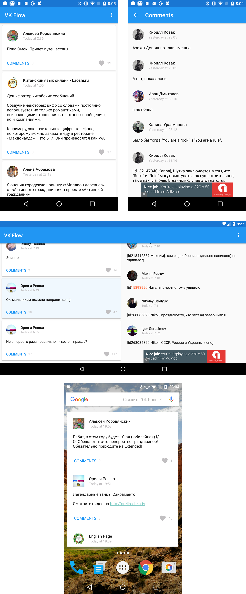

# capstone
The sixth project for Udacity's Android Nanodegree.

VK Flow is a simple fast client for the largest European social network - VK (www.vk.com). It allows you to follow some news from a life of your friends, watch post’s likes and read comments.

